# Seamark Global Innovations — Business Intelligence Platform

**Stage 1:** Analytics Pipeline (Jun/Jul 2026)
**Stage 2:** Prophet AI Forecasting (Aug/Sep 2026)
**Stage 3:** Commercial Execution (planned)

---

## 🚀 Quick Start
```bash
git clone https://github.com/sunny171p/Seamark-DataScience-Platform.git
cd Seamark-DataScience-Platform
python -m venv .venv
.venv\Scripts\activate
pip install -r requirements.txt
streamlit run dashboard/seamark_dashboard.py
```

Open your browser at **http://localhost:8501**

---

## What This Project Is

This is a data science and business intelligence platform built on real
Shopify export data from The Seamark Global Innovations, a multi-category
e-commerce store. The store is pre-launch: it has real product, traffic
and pricing data, but has not yet taken a real order.

Because of that, this project has two honest purposes rather than one.
The first is diagnostic — going through the store's actual data to find
every weakness, pricing error, and structural gap before real customers
arrive, since problems are far cheaper to fix now than after launch. The
second is to demonstrate a working forecasting and BI pipeline, built and
tested end to end, ready to run on real sales the moment they exist. Where
a number on the dashboard is a genuine prediction rather than a measured
fact, this README and the dashboard itself say so directly — see
`DATA_PROVENANCE.md` for the full breakdown of what's computed, what's a
dated manual input, and what's a synthetic placeholder used only to
demonstrate the forecasting engine.

---

## Project Structure

### Stage1_Analytics/analytics/ — Data Science Pipeline

Scripts that process and analyse real Shopify export data from the store.
`pipeline.py` in the project root runs all nine stages, in the correct
order, in one go.

- **01_data_cleaning.py** — Cleans and standardises the raw Shopify
  product export (8,078 rows, one per product variant/description block)
  down to 316 deduplicated products. This is the foundation for every
  downstream script.
- **02_product_classification.py** — A keyword-based classification
  engine that automatically sorts the 316 products into 10 commercial
  categories.
- **03_funnel_analysis.py** — Analyses session-to-checkout data to
  identify where the funnel actually breaks down.
- **04_pricing_analysis.py** — Audits compare-at prices across the
  catalogue and flags misleading discounts, saving a summary chart to
  `outputs/pricing_analysis.png`.
- **Stage 4.5 — `automation/forecasting/enrich_price_check.py`** — Builds
  the detailed, per-product pricing table (`outputs/price_check_enriched.csv`)
  that Stage 8 reads to compute the pricing-integrity score. This used to
  be a separate script nobody ran automatically; it's now wired into
  `pipeline.py` as its own stage so a fresh clone doesn't crash at Stage 8
  for want of a file nothing had produced yet.
- **05_competitive_pricing.py** — Benchmarks Seamark's average price per
  category against manually-researched Amazon UK prices
  (`raw_data/amazon_uk_benchmarks.csv`).
- **06_affiliate_analysis.py** — Evaluates UpPromote affiliate signups by
  status, country and source.
- **07_traffic_analysis.py** — Reads the Shopify traffic-source,
  landing-page and page-load exports to find out where sessions actually
  come from and how far people browse before leaving.
- **08_pipeline_health.py** — Computes the real pricing-integrity score
  and row counts shown on the dashboard's Pipeline Health page, rather
  than those being typed in by hand.

### automation/ — Operations Scripts

- **setup_analytics_db.py** — Initialises the SQLite schema used by the
  automation scripts below.
- **csv_bulk_import_from_excel_sheet.py** — Bulk-imports a CSV export
  into that database.
- **live_exchange.py** — Fetches a live USD/GBP exchange rate.
- **manage_inventory.py** / **view_inventory.py** — Command-line stock
  management and lookup tools.
- **Seamark_store_insights.py** — Joins product, sales and inventory
  tables into a single report.

### automation/forecasting/ — AI Forecasting Pipeline

- **create_sales_csv.py** — Builds the sample order series used to train
  the forecast (see the note on synthetic data below).
- **sales_forecast.py** — Prophet forecasting engine. Produces the
  90-day revenue forecast in `outputs/sales_forecast_90days.csv`.
- **product_demand_forecast.py** — Per-product demand forecasts.
- **enrich_price_check.py** — Builds the enriched, per-product pricing
  table Stage 8 depends on. Runs automatically as Stage 4.5 of
  `pipeline.py` (see Stage1_Analytics/analytics/ above) — no longer a
  manual step.
- **process_inventory.py** — Flags stock-out risk from forecast velocity.
- **merge_inventory_dbs.py** / **compare_inventory_dbs.py** — Utilities
  for reconciling inventory records from different sources.
- **weekly_scheduler.py** — Intended to run the forecasting pipeline on
  a schedule; not currently wired into the dashboard.

### dashboard/ — Web Application

- **seamark_dashboard.py** — The Streamlit business intelligence
  dashboard: real-time pricing audit, competitive analysis, traffic
  analysis, affiliate tracking, and the AI forecast, all reading from
  the CSV outputs the scripts above produce rather than from figures
  typed into the dashboard itself.

### tests/ — Automated Checks

Three test files that redo the key calculations independently from raw
data and fail if a saved output stops matching, guard against previously
fabricated figures being typed back into the dashboard, and smoke-compile
every script. Run with `pytest` from the project root.

---

## Honest Business State (as of this pipeline run)

These numbers come straight from the pipeline's own output files
(`outputs/*.csv`) — re-run `pipeline.py` and they'll update themselves,
which is the whole point of not typing them in by hand.

- **Products in catalogue:** 316 (from 8,078 raw Shopify export rows)
- **Products price-checked:** 271
- **Real completed orders:** 0 — this store has not taken a real sale
  yet. `Stage1_Analytics/data/orders_export.csv` contains synthetic rows
  built only to give the Prophet forecast a training series to
  demonstrate on; it is not real revenue, and nothing on the dashboard
  presents it as such.
- **Real checkout conversion rate:** 5.96% of sessions reach checkout,
  but Shopify's own "Conversion rate" column reads 0% every month —
  nobody has completed a purchase.
- **Pricing integrity score:** 4.4% — 259 of the 271 price-checked
  products (95.6%) show a "compare at" discount that the data doesn't
  actually support. This is the single biggest data-quality issue this
  project found.
- **Traffic:** 87.8% of sessions arrive direct (no referrer at all), and
  79.7% land on the homepage first. Of all tracked page loads, only 6.5%
  ever reach a product page. Read together, this points to a discovery
  problem — people who already have the link are visiting, but almost
  nobody is finding the store through search, ads, or browsing.
- **Competitive pricing vs Amazon UK:** cheaper in 6 of 10 categories
  (Audio, Electronics, Fitness, Footwear, Photography, Other), more
  expensive in 4 (Apparel, Health & Beauty, Kitchen Appliances, Smart TV)
  — see `outputs/competitive_pricing.csv` for the full table.
- **90-day AI revenue forecast:** £242, trained on 11 synthetic order
  points spread across five months (the dashboard's own "Projected
  Revenue" / "AI Forecast Revenue" cards show this same figure, live,
  from `outputs/sales_forecast_90days.csv`). This demonstrates that the
  forecasting pipeline works end to end, not a reliable prediction —
  there isn't enough real sales history yet for Prophet to forecast
  from, and the model should be retrained the moment genuine orders
  start coming in. See `DATA_PROVENANCE.md` for the full explanation.
- **Affiliates:** 10 registered, 9 active.

---

## What Was Built in Stage 2

| Component | Description | Status |
|---|---|---|
| Prophet AI Forecast Engine | 90-day demand forecast, currently trained on synthetic data | ✅ Built, awaiting real sales |
| Streamlit BI Dashboard | Real-time dashboard reading from pipeline outputs, not hand-typed figures | ✅ Live |
| Pricing Audit Engine | Flags misleading compare-at pricing | ✅ Live |
| Competitive Price Analysis | Benchmarks Seamark vs Amazon by category | ✅ Live |
| Traffic & Discovery Analysis | Traffic source, landing page and page-depth analysis | ✅ Live |
| Affiliate Analytics | Tracks 10 affiliates across UpPromote | ✅ Live |
| Automated Test Suite | Regression tests for every pipeline output and a guard against fabricated figures | ✅ Live |
| Weekly Auto Scheduler | Automated pipeline runs on a schedule | ⏳ Built, not yet wired in |

---

## What This Project Found

- The real pricing-integrity score is 4.4%, not the reassuring figure
  this dashboard used to show before it was reading from actual data —
  259 of 271 price-checked products have a discount comparison that
  doesn't hold up. That's a catalogue-wide issue, not a handful of
  mistakes, and worth fixing before launch given how it looks under UK
  pricing-transparency rules.
- 87.8% of traffic is direct and only 6.5% of page loads ever reach a
  product page — the store currently has no functioning discovery
  engine; growth right now depends entirely on people who already have
  the link.
- The store is genuinely pre-launch: real conversion rate is 0%, and the
  four datasets that could plausibly describe "sales" all agree on that,
  independently, once checked against each other.
- Building this pipeline surfaced several duplicate or contradictory
  data sources during development (two categorisation systems, two
  inventory databases, a pricing figure that disagreed with itself on
  different dashboard pages) — all resolved so that every number on the
  dashboard now traces back to one calculation in one place.

---

## Technologies Used

- Python 3.x, Pandas, Matplotlib
- SQLite3 — relational database for the automation scripts
- Prophet — AI demand forecasting
- Streamlit — the business intelligence dashboard
- Supabase — used by `product_demand_forecast.py` for cloud storage of
  per-product forecasts
- pytest — automated test suite

---

## How To Run

### Install dependencies
```bash
pip install -r requirements.txt
```

### Set up environment variables
Create a `.env` file in the project root with whichever of these your
setup uses:
```
SUPABASE_URL=your_supabase_url
SUPABASE_KEY=your_supabase_key
```

### Run the full analytics pipeline
```bash
python pipeline.py
```
This runs all nine stages — the eight `Stage1_Analytics/analytics/`
scripts plus Stage 4.5 (`automation/forecasting/enrich_price_check.py`)
— in order, and writes their outputs to `outputs/` and
`Stage1_Analytics/outputs/`.

### Run the forecasting scripts
```bash
python automation/forecasting/sales_forecast.py
python automation/forecasting/product_demand_forecast.py
```

### Launch the dashboard
```bash
streamlit run dashboard/seamark_dashboard.py
```
Open your browser at http://localhost:8501

### Run the tests
```bash
pytest
```

---

## Stage 3 Priorities

- [ ] Fix the 259 misleading compare-at prices via a Matrixify bulk CSV
- [ ] Apply the product category classifications to the live Shopify catalogue
- [ ] Build a customer-acquisition plan to address the direct-traffic/discovery gap
- [ ] Restructure the affiliate programme — tiered commissions + UK recruitment
- [ ] Retrain the Prophet forecast on real orders once the store has genuine sales
- [ ] Review Smart TV and Kitchen Appliance pricing against the Amazon benchmarks

---

## Dashboard Screenshots

Screenshots below are from earlier development milestones and may not
match the dashboard's current figures — the dashboard itself is always
the current source of truth.

### Overview
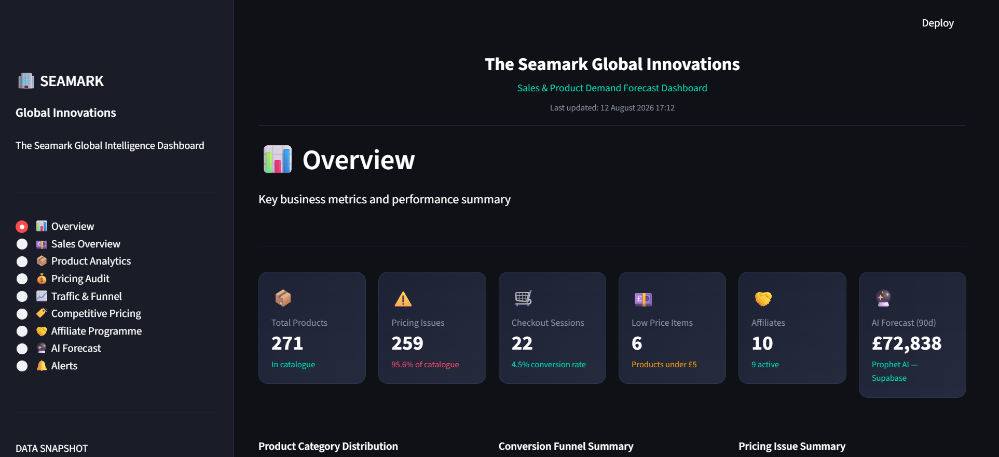

### Sales Overview
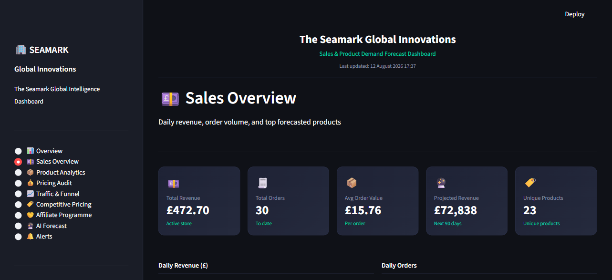

### Product Analytics
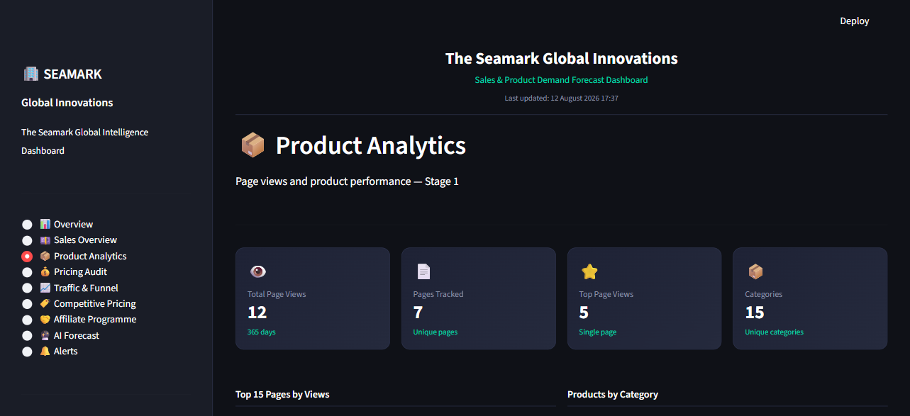

### Pricing Audit
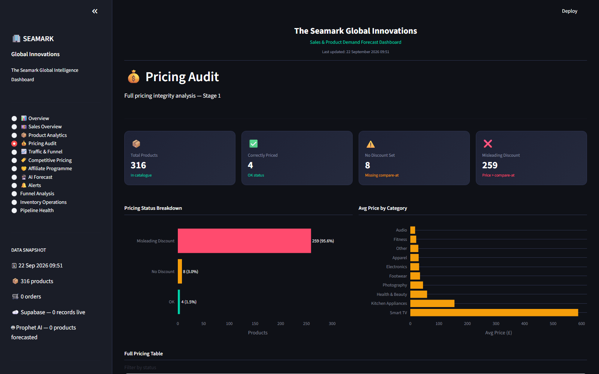

### Traffic & Funnel
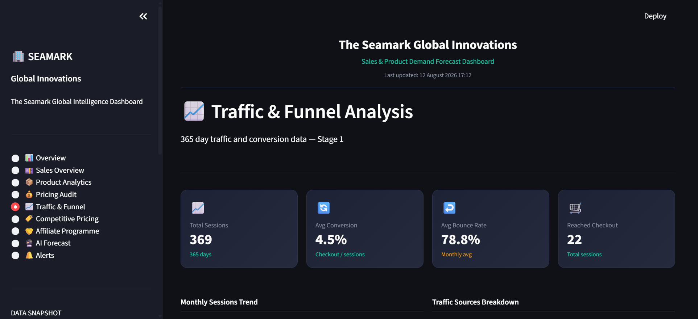

### Competitive Pricing
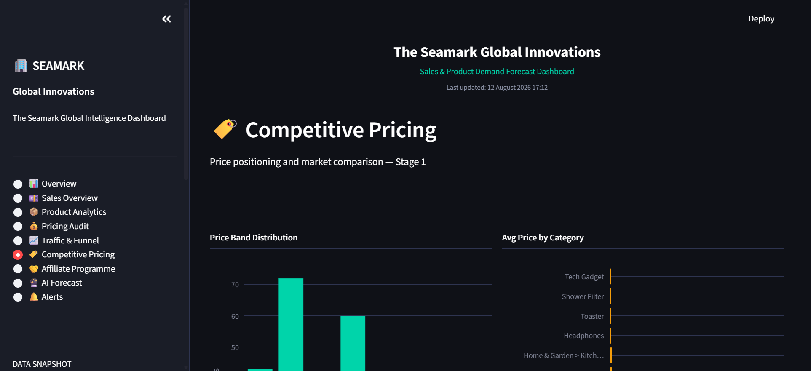

### Affiliate Programme
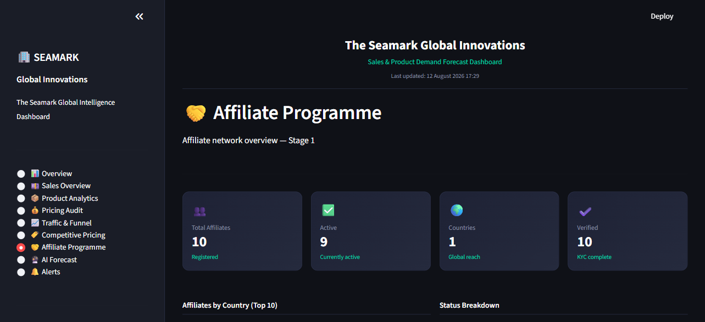

### AI Forecast
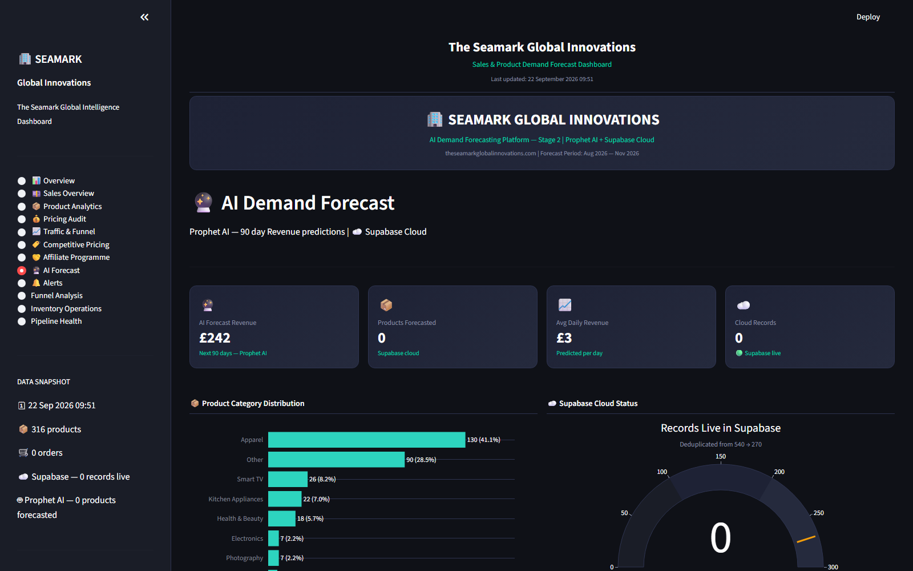

### Alerts
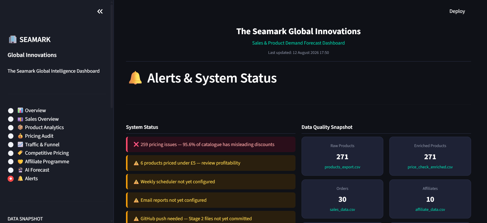

---

## Stage 1 Analytics Charts

### Product Categories
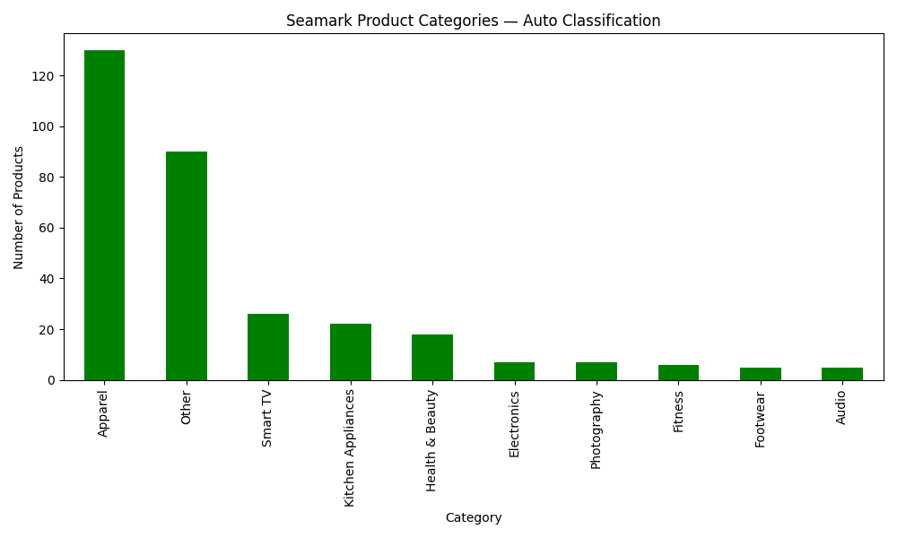

### Pricing Analysis
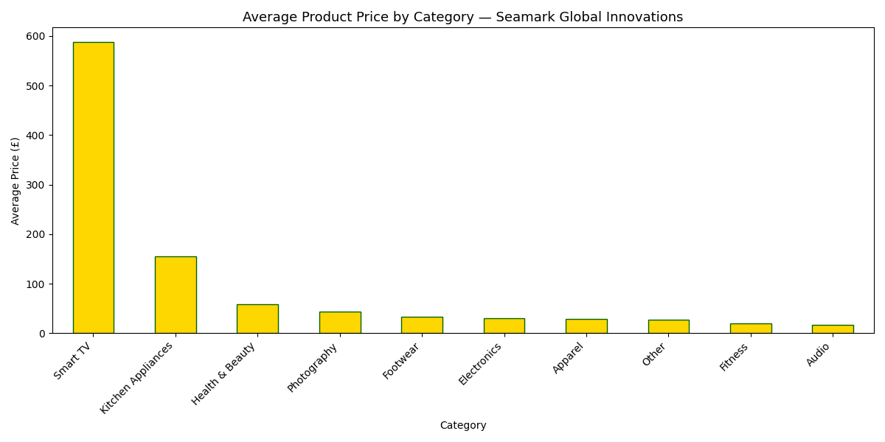

### Funnel Analysis


### Competitive Pricing vs Amazon
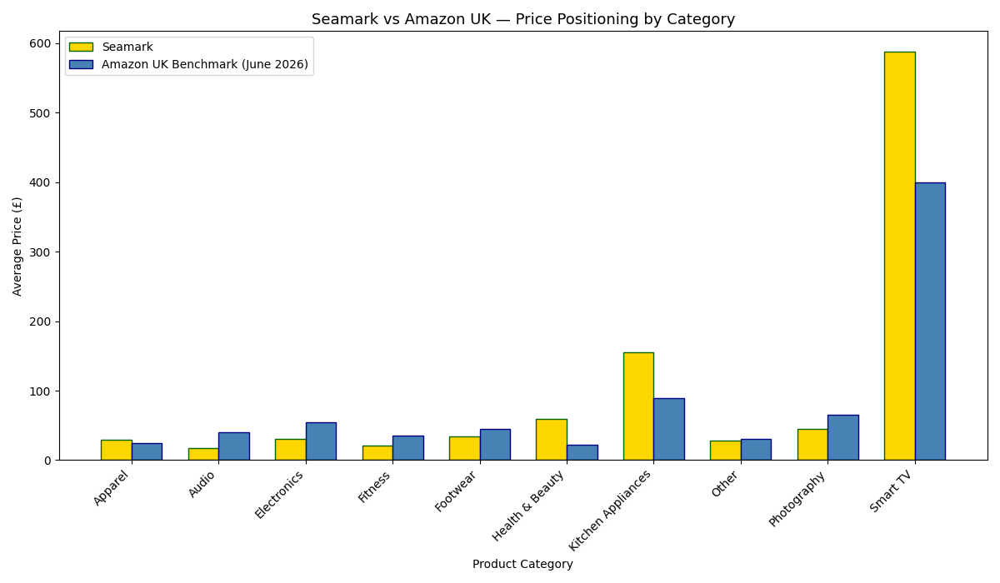

### Affiliate Analysis
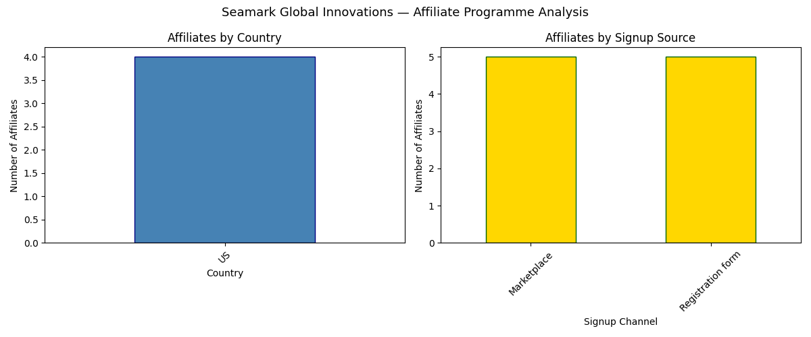

### Sales Forecast
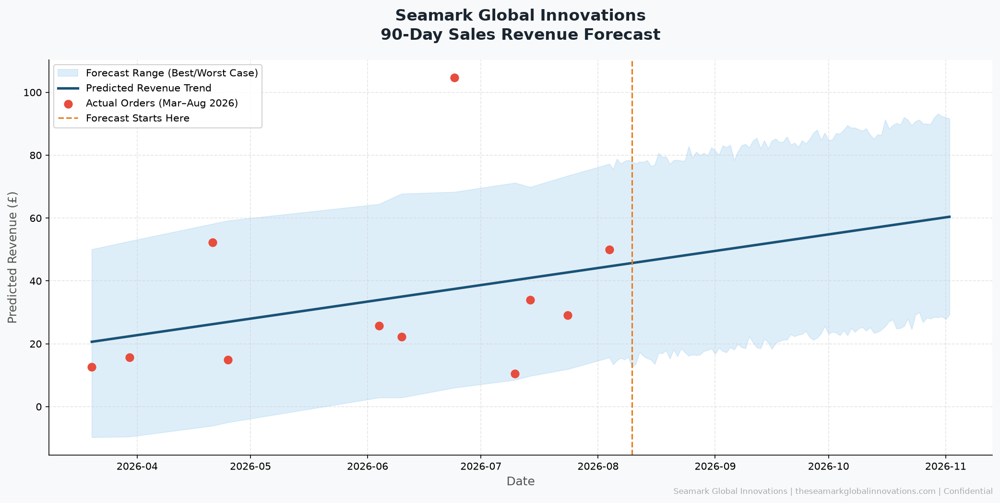

---

## Author

**Sunday Emmanuel Azeez**
Founder & Data Engineer — The Seamark Global Innovations
GitHub: github.com/sunny171p
Website: theseamarkglobalinnovations.com
