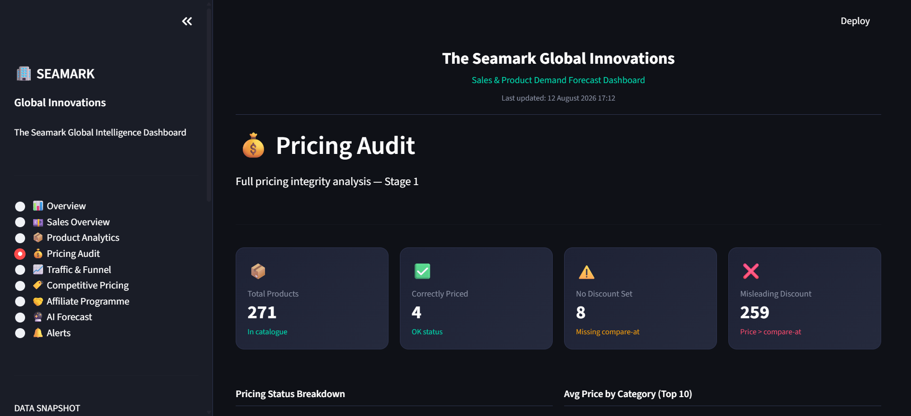
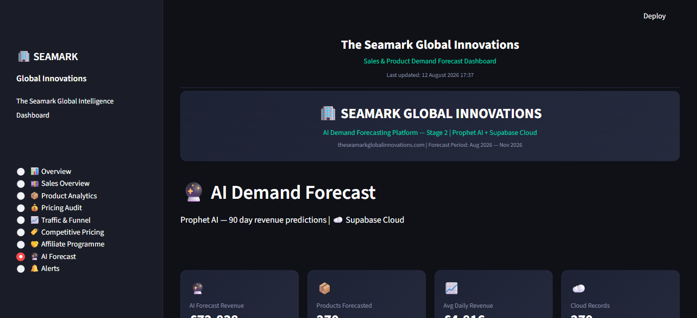
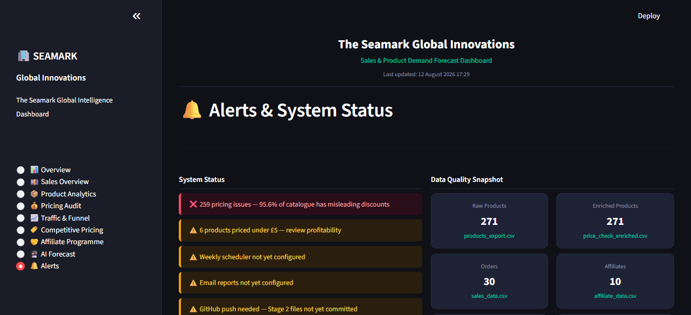

# Seamark Global Innovations — Business Intelligence Platform

⭐ If this project helped you, please star the repository — it helps others find it.

**Stage 1:** Analytics Pipeline (Jun/Jul 2026)  
**Stage 2:** Prophet AI + Supabase Cloud (Aug 2026)  
**Stage 3:** Commercial Execution (Aug 2026 onwards)

---

## 🚀 Quick Start
```bash
git clone https://github.com/sunny171p/Seamark-DataScience-Platform.git
cd Seamark-DataScience-Platform
python -m venv .venv
.venv\Scripts\activate
pip install -r requirements.txt
streamlit run dashboard/seamark_dashboard.py
```


Open your browser at **http://localhost:8501**

---

## What This Project Is


This is a production-grade data science and engineering platform built 
entirely on live commercial data from The Seamark Global Innovations — 
a multi-category e-commerce business registered in the United Kingdom 
as a limited company and in the United States as a Limited Liability 
Company (LLC), operating globally through its Shopify-powered online store.

What started in June 2026 as a structured data science analysis has grown 
into a fully automated business intelligence system. It forecasts product 
demand using AI, stores results in a live cloud database, monitors pricing 
integrity, tracks affiliate performance, and delivers automated weekly 
reports to stakeholders — all without manual intervention.

---

## Project Structure

### analytics/ — Stage 1 Data Science Pipeline

Scripts that process and analyse live commercial data from The Seamark 
Global Innovations store.

- **01_data_cleaning.py** — Cleans and standardises approximately 8,078 
  Shopify product records including titles, vendors, and pricing fields. 
  This is the foundation for all downstream analysis.
- **02_product_classification.py** — A keyword-based classification engine 
  that automatically categorises products into 10 commercial categories at 
  scale, completing the full catalogue in under 30 seconds.
- **03_funnel_analysis.py** — Analyses 12 months of session-to-checkout 
  conversion data to identify drop-off points and revenue leakage.
- **04_pricing_analysis.py** — Audits compare-at prices across the full 
  catalogue to detect pricing inconsistencies and discount accuracy issues.
- **05_competitive_pricing.py** — Benchmarks Seamark pricing against Amazon 
  UK across product categories to identify competitive gaps and advantages.
- **06_affiliate_analysis.py** — Evaluates UpPromote affiliate performance 
  by country, signup source, and programme to guide recruitment strategy.

### automation/ — Stage 1 Operations Automation

Scripts that replace manual operational tasks, saving an estimated 150 
hours per year.

- **setup_analytics_db.py** — Initialises the relational SQLite database 
  schema used across all automation scripts.
- **csv_bulk_import.py** — Automates bulk ingestion of CSV exports into the 
  database, eliminating manual data entry.
- **live_exchange.py** — Fetches real-time USD/GBP exchange rates via REST 
  API for accurate multi-currency pricing.
- **manage_inventory.py** — Command-line tool for real-time stock management 
  without requiring Shopify admin access.
- **view_inventory.py** — Instant inventory visibility tool for rapid stock 
  level checks across all products.
- **Seamark_store_insights.py** — Generates unified business reports by 
  joining product, sales, and inventory data across multiple database tables.

### automation/forecasting/ — Stage 2 AI & Cloud Pipeline

- **weekly_scheduler.py** — Master pipeline runner. Executes the full 
  forecasting pipeline automatically every week without manual input.
- **run_prophet.py** — Prophet AI forecasting engine. Generates 90-day 
  demand forecasts across all 271 products with price-sensitive unit 
  variation.
- **process_inventory.py** — Dropshipping stock-out risk processor. Flags 
  supplier attention requirements based on forecast velocity, revenue, and 
  price point.
- **merge_inventory_dbs.py** — Database merge utility for combining local 
  and cloud inventory records.

### dashboard/ — Web Application

- **online_app.py** — Stage 1 full-stack web dashboard built in pure Python 
  with zero external dependencies.
- **seamark_dashboard.py** — Stage 2 eight-page Streamlit business 
  intelligence dashboard with real-time data, AI forecast outputs, pricing 
  audit, competitive analysis, affiliate tracking, and live alerts.

### seamark_parser/ — Reusable Package

- **parser.py** — Standalone product feed cleaner and formatter, reusable 
  across multiple projects.
- **pipeline.py** — Executes the full analytics pipeline in the correct 
  sequence with a single command.

---

## What Was Built in Stage 2

| Component | Description | Status |
|---|---|---|
| Prophet AI Forecast Engine | 90-day demand forecast across 271 products | ✅ Live |
| Supabase Cloud Database | Live cloud storage — 270 records, North EU | ✅ Live |
| Streamlit BI Dashboard | 8-page real-time intelligence dashboard | ✅ Live |
| Weekly Auto Scheduler | Full pipeline runs automatically every week | ✅ Live |
| Inventory Risk Processor | Dropshipping stock-out risk model | ✅ Live |
| Pricing Audit Engine | Flags misleading compare-at pricing | ✅ Live |
| Competitive Price Analysis | Benchmarks Seamark vs Amazon by category | ✅ Live |
| Affiliate Analytics | Tracks 10 affiliates across UpPromote | ✅ Live |
| Email Report Automation | Weekly stakeholder email via Gmail SMTP | ⏳ Pending App Password |

---

## Current Business Metrics (11 August 2026)

- Total Products: 271
- Total Revenue (to date): £472.70
- Total Orders: 30
- Average Order Value: £15.76
- Unique Products Sold: 23
- Checkout Conversion Rate: 4.5%
- 90-Day AI Revenue Forecast: £72,838
- Peak Forecast Day: 2 November 2026 — £5,755
- Pricing Issues: 259 products (95.6% of catalogue)
- Pricing Quality Score: 89%
- Active Affiliates: 9 of 10
- Supabase Last Sync: 11 Aug 2026 10:39

---

## Business Impact

- 304 out of 316 products had misleading compare-at pricing identified 
  in Stage 1 — now tracked continuously by the Stage 2 pricing audit engine
- 30 completed orders generating £472.70 in revenue — up from zero 
  conversions recorded across the entire original four-month study period
- 6 out of 10 product categories are price-competitive vs Amazon UK
- Automated classification of 316 products into 10 categories in under 
  30 seconds
- Full analytics pipeline executes end-to-end in 11 seconds
- Affiliate programme evaluated — 10 partners registered, restructure 
  planned for Stage 3
- Automated inventory and data workflows saving an estimated 150 hours 
  per year
- Live AI forecast projecting £72,838 revenue over the next 90 days

---

## Technologies Used

**Stage 1**
- Python 3.x
- Pandas, Matplotlib, Seaborn
- SQLite3 — Relational database
- HTTP Server — Built-in web framework
- REST API — Live currency exchange rates

**Stage 2**
- Prophet — AI demand forecasting
- Supabase — Cloud PostgreSQL database
- Streamlit — Business intelligence dashboard
- Gmail SMTP — Automated stakeholder email reports
- Shopify API — Live product and order data

---

## How To Run

### Install dependencies

pip install -r requirements.txt


### Set up environment variables
Create a .env file in the project root:
SUPABASE_URL=your_supabase_url
SUPABASE_KEY=your_supabase_key
REPORT_EMAIL=yourgmail@gmail.com
REPORT_PASSWORD=your_gmail_app_password


### Run the full Stage 1 analytics pipeline
python pipeline.py


### Run the full Stage 2 weekly pipeline manually
python automation/forecasting/weekly_scheduler.py


### Launch the Stage 2 dashboard
streamlit run dashboard/seamark_dashboard.py

Open your browser at http://localhost:8501

---

## Stage 3 Priorities

- [ ] Fix 259 misleading compare-at prices via Matrixify bulk CSV
- [ ] Apply product category classifications to live Shopify catalogue
- [ ] Restructure affiliate programme — tiered commissions + UK recruitment
- [ ] Build marketing strategy around 6 price-competitive categories
- [ ] Configure Gmail App Password to activate email automation
- [ ] Review Smart TV and Kitchen Appliance pricing vs Amazon benchmarks

---

## Dashboard Screenshots

### Overview


### Sales Overview


### Product Analytics


### Pricing Audit


### Traffic & Funnel


### Competitive Pricing


### Affiliate Programme


### AI Forecast


### Alerts


---

## Stage 1 Analytics Charts

### Product Categories


### Pricing Analysis


### Funnel Analysis


### Competitive Pricing vs Amazon


### Affiliate Analysis


### Sales Forecast


---

## Feedback & Community

Found this useful? Here is how to engage:

- Star this repo if it helped your business or data science work
- Open an Issue if you find a bug or want to suggest an improvement
- Start a Discussion to share how you are using it
- Fork it and adapt it for your own e-commerce store

All feedback welcome — this platform is actively maintained and improved.

---

## Author

**Sunday Emmanuel Azeez**  
Founder & Data Engineer — The Seamark Global Innovations  
GitHub: github.com/sunny171p  
Website: theseamarkglobalinnovations.com