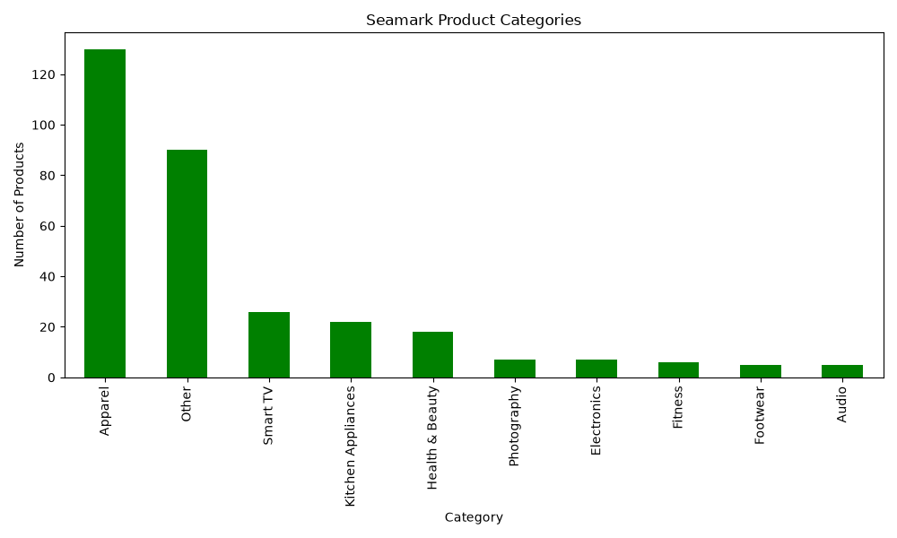
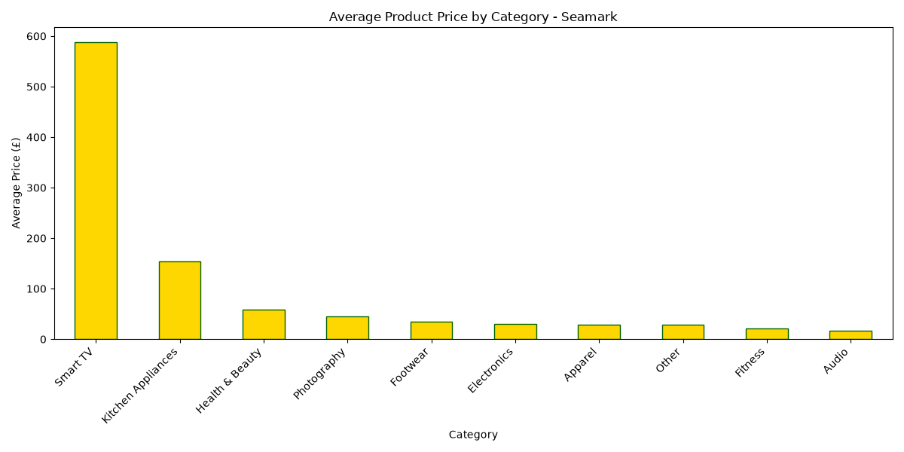
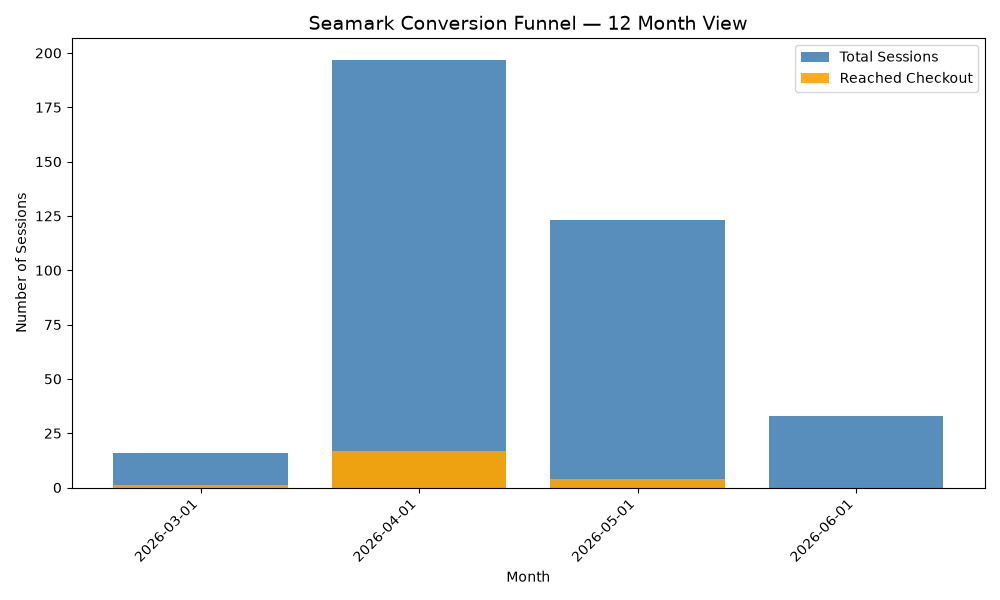
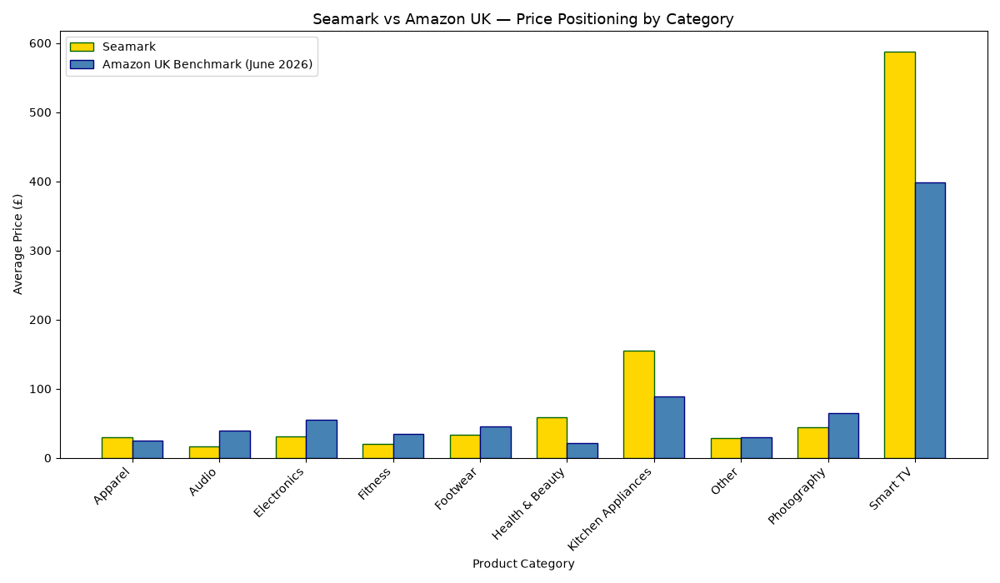
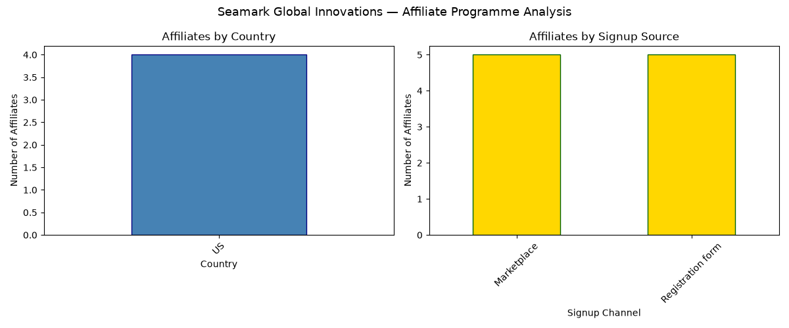

# Seamark Data Science Platform

⭐ If this project helped you, please star the repository — it helps others find it.

# Seamark Data Science Platform

A production-grade data science and automation platform built on live commercial data 
from The Seamark Global Innovations e-commerce business.

## Overview

A full-stack data science and automation platform built on live commercial 
data from The Seamark Global Innovations e-commerce business.

---

## Project Structure

### analytics/ — Data Science Pipeline
Scripts that process and analyse live commercial data from The Seamark Global Innovations store.

- **01_data_cleaning.py** — Cleans and standardises ~8,078 Shopify product records including titles, vendors, and pricing fields. Foundation for all downstream analysis.
- **02_product_classification.py** — Keyword-based classification engine that automatically categorises products into 10 commercial categories at scale.
- **03_funnel_analysis.py** — Analyses 12 months of session-to-checkout conversion data to identify drop-off points and revenue leakage.
- **04_pricing_analysis.py** — Audits compare-at prices across the full catalogue to detect pricing inconsistencies and discount accuracy.
- **05_competitive_pricing.py** — Benchmarks Seamark pricing against Amazon UK across product categories to identify competitive gaps.
- **06_affiliate_analysis.py** — Evaluates UpPromote affiliate performance by country, signup source, and programme to guide recruitment strategy.

---

### automation/ — Operations Automation
Scripts that replace manual operational tasks, saving an estimated 150 hours per year.

- **setup_analytics_db.py** — Initialises the relational SQLite database schema used across all automation scripts.
- **csv_bulk_import.py** — Automates bulk ingestion of CSV exports into the database, eliminating manual data entry.
- **live_exchange.py** — Fetches real-time USD/GBP exchange rates via REST API for accurate multi-currency pricing.
- **manage_inventory.py** — Command-line tool for real-time stock management without requiring Shopify admin access.
- **view_inventory.py** — Instant inventory visibility tool for rapid stock level checks across all products.
- **Seamark_store_insights.py** — Generates unified business reports by joining product, sales, and inventory data across multiple database tables.

---

### dashboard/ — Web Application
- **online_app.py** — Full-stack web dashboard built in pure Python with zero external dependencies.

### seamark_parser/ — Reusable Package
- **parser.py** — Standalone product feed cleaner and formatter, reusable across multiple projects.

### pipeline.py
Executes the full analytics pipeline in the correct sequence with a single command.

---

## Technologies Used

- Python 3.x
- Pandas, Matplotlib, Seaborn
- SQLite3 — Relational database
- HTTP Server — Built-in web framework
- REST API — Live currency exchange rates

---

## Business Impact

- 304 out of 316 products had misleading compare-at pricing
- 22 customers reached checkout over 4 months with 0 conversions
- 6 out of 10 product categories are price-competitive vs Amazon UK
- Automated classification of 316 products into 10 categories in under 30 seconds
- Full pipeline executes end-to-end in 11 seconds
- Affiliate programme evaluated — 10 partners registered, zero commercial output identified
- Automated inventory and data workflows saving an estimated 150 hours per year
- Delivered a browser-accessible web dashboard for live business monitoring

## Output Charts

### Product Categories

### Pricing Analysis

### Funnel Analysis

### Competitive Pricing vs Amazon

### Affiliate Analysis

## Feedback & Community

Found this useful? Here is how to engage:

-  *Star this repo* if it helped your business or data science work
-  *Open an Issue* if you find a bug or want to suggest an improvement
-  *Start a Discussion* to share how you are using it
-  *Fork it*   and adapt it for your own e-commerce store

All feedback welcome — this platform is actively maintained and improved.
 

## Author

**Sunday Emmanuel Azeez**
Founder & Data Engineer — The Seamark Global Innovations
GitHub: [github.com/sunny171p](https://github.com/sunny171p)
Website: [theseamarkglobalinnovations.com](https://theseamarkglobalinnovations.com)
